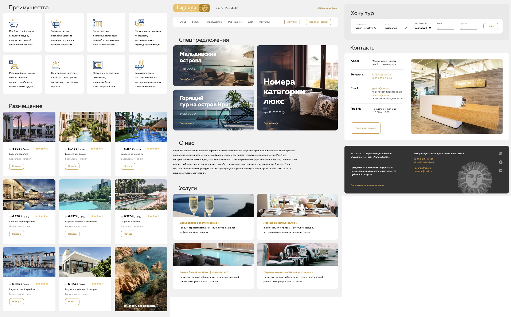

# Laguna Website 2024

## Описание проекта
**Laguna Website 2024** — это веб-сайт, разработанный для компании Laguna. Основная цель проекта — создать современный, интуитивно понятный и эстетически привлекательный сайт, который предоставляет пользователю полный доступ к услугам и информации о компании.

## Демо


**Ссылка на демо-версию сайта:** [Laguna Website 2024](https://laguna-website.com/demo)

## Технологии
Проект создан с использованием следующих технологий:
- **Язык разметки и стилей**: HTML, CSS, SCSS, JavaScript


## Основные особенности проекта
- Дизайн, обеспечивающий удобный доступ.
- Удобный интерфейс с разделением на услуги, команду и контактную информацию.

## Техническое описание проекта

### Установка
1. Клонируйте репозиторий:
    ```sh
    git clone https://github.com/skv0r/Laguna-Website-2024.git
    ```

2. Запустите проект в открытием index.html:


### Структура проекта
- **index.html** - основная директория с исходным кодом сайта.
  - **fonts** - все подключаемые стили в проект формата woff2, woff.
  - **blocks** - отдельные блоки сайта, включая главную, шапку с навигацией, карточки спец-предложений, блок с информацией, карточки услуг, преимущества, варианты отелей, выбор рейса, контакты, футер.
  - **style** - стили проекта (CSS и SCSS).


## Проблемы и решения
### Проблемы
- На начальном этапе возникли сложности с позиционирование svg и создание формы.
- Были сложности с оптимизацией производительности при рендеринге большого количества компонентов (картинок).

### Решения
- Компоненты были разделены на более мелкие части и были оптимизированы для минимального потребления ресурсов.

## Контакты
- Разработчик: Григорий Буренков
- Email: [skvorgrand@gmail.com](mailto:skvorgrand@gmail.com)
